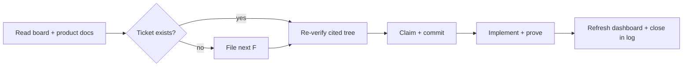

# AGENTS.md — operating guide

**This file is normative.** Every rule for a coding agent working in this repository — Codex, Claude
Code, or any other — lives here. Read it before doing anything. When this file conflicts with a
narrative document, this file wins.

## Project snapshot

WhisperMeet is a native macOS app (SwiftPM, no Xcode project) that records a meeting's microphone
and Mac system audio, then produces an accurate **post-meeting** transcript using a selected local
subprocess. OpenAI Whisper Large is the default; Apple-silicon Macs may opt into Qwen3-ASR 1.7B MLX
8-bit plus its forced aligner. Recording and transcription use no API key, no cloud upload, and no
realtime transcription; transcripts remain in their original spoken language (English or Mandarin).

The one exception is **opt-in Claude summaries**: only after a user saves a Claude API key and
confirms an explicit Summarize action is the transcript sent to Anthropic. The recording is never
mutated, failures remain retryable, and evidence always beats assertion.

## Start every task

| Step | Do this | Stop or continue when… |
|---|---|---|
| 1. Orient | Read [`docs/TICKETS.md`](docs/TICKETS.md), [`docs/NEEDS_HUMAN.md`](docs/NEEDS_HUMAN.md), and the relevant product docs from [`docs/README.md`](docs/README.md). | Never rely on an old chat description over the current tree. |
| 2. Find or file | Locate the ticket. If none covers the work, take the next free `F<n>` and file it. | Do not start an untracked task. |
| 3. Verify and claim | Re-check cited code, then set it `in-progress` with an owner and commit that claim. | Never take another agent's `in-progress` ticket. |
| 4. Build evidence | Make the smallest coherent change; keep a failing-before/passing-after test when behavior changes. | Use synthetic clips, never a user's data. |
| 5. Hand off cleanly | Run the required verification, refresh/check the dashboard, then close in the append-only log. | Mention the ticket ID in every related commit. |



## Sources at a glance

| Source | Use it for |
|---|---|
| [`docs/README.md`](docs/README.md) | The human and agent documentation map. |
| [`docs/tickets-dashboard.html`](docs/tickets-dashboard.html) | Fast, static visual view of active work; Markdown below remains authoritative. **Local-only (gitignored)**, generated by `Scripts/generate-tickets-dashboard.py`. |
| [`docs/TICKETS.md`](docs/TICKETS.md) | Active work only. **Local-only (gitignored).** |
| [`docs/NEEDS_HUMAN.md`](docs/NEEDS_HUMAN.md) | Letters to the user: actions or decisions only a person can make (soft cap five — see rule 8). Version-controlled. The ticket for each stays on the board or in the log. |
| [`docs/TICKET_LOG.md`](docs/TICKET_LOG.md) | Append-only closures and real evidence. **Local-only (gitignored).** |
| [`docs/PRODUCT_SPEC.md`](docs/PRODUCT_SPEC.md) | Non-negotiable product requirements. |
| [`docs/ROADMAP.md`](docs/ROADMAP.md) | Aspirational backlog, not a commitment. |
| [`docs/CHANGELOG.md`](docs/CHANGELOG.md) | Human-facing shipped history. |

## Ticket rules

`docs/TICKETS.md` is the single source of truth for outstanding **work**; this file is the single
source of truth for the **rules** that govern it. Both are binding.

**Version control (2026-08-07).** The ticket board (`docs/TICKETS.md`), the log (`docs/TICKET_LOG.md`),
the generated dashboard (`docs/tickets-dashboard.html`), and their generator/tests
(`Scripts/generate-tickets-dashboard.py`, `Scripts/tests/test_generate_tickets_dashboard.py`) are
**gitignored, local-only agent state** — they are not committed. `docs/NEEDS_HUMAN.md` and the product
docs remain version-controlled. Because the board and log are not tracked, the "in the same commit"
requirements in the rules below are **no longer git-enforced**: read them as the discipline to keep
your local board and log in step with the code commit the work produces. That code commit still must
reference the ticket's `F<n>` (rule 7), so `git log --grep=F<n>` remains the durable trail — the ticket
entries themselves live only in your working copy.

1. **Read the board first.** Read `docs/TICKETS.md` before starting any task. If the work you are
   about to do is not on the board, file it as a ticket before you start, so parallel agents can see
   it.
2. **File what you find.** Every defect, regression, unverified claim, or follow-up you notice —
   from code review as much as from implementation — gets a ticket, even one you are not going to
   fix. A finding that lives only in a chat reply dies with the session.
3. **Verify before you claim.** Before claiming a ticket, re-verify that the cited `file:line` still
   shows the described problem in the current tree. If the code has moved or the issue is already
   gone, close the ticket `invalid` with that evidence and move on — do not fix from the ticket's
   description alone. Descriptions go stale; the tree is the source of truth.
4. **Claim before you work.** Set `Status: in-progress` and put your agent/session identifier in
   `Owner` in the **same commit that begins the work**. Never take a ticket already `in-progress`.
5. **Never delete a ticket.** Close it by moving the entry out of `docs/TICKETS.md` and appending it
   to `docs/TICKET_LOG.md` with an outcome — `fixed`, `partial`, `wontfix`, `invalid`, or
   `duplicate`. Deleting loses the reasoning.
6. **Log on close with real evidence.** Append to `docs/TICKET_LOG.md` with real command output —
   the test failing before the fix, the test passing after, the build, and any real-model run — not
   a summary of intent. The repo's culture is evidence over assertion. The log is **append-only**:
   never edit or delete a closed entry. The one sanctioned exception is appending a follow-up
   ticket's `F<n>` cross-reference to an existing entry's **Gaps** line, so deferred work it named
   stays traceable to the board.
7. **One ticket, one commit trail.** Reference the ID in **every** commit message that touches it,
   in the existing repo style: `fix(dictation): keep helper stdout pure JSON (F24)`.
8. **Escalate human-blocked work.** When work needs a person, write a letter in
   `docs/NEEDS_HUMAN.md` in the **same commit**, with a `**What I need from you:**` line stating the
   single concrete action required — and **keep the ticket on the board as `blocked`**, with
   `Blocked by:` pointing at that letter.

   *Clarified 2026-09-17 (whisper-37), settling a question whisper-62 raised and deliberately left
   open.* This rule used to say "move the entry", and moving it is what loses things: F288 was moved
   out and then existed in neither `TICKETS.md` nor `TICKET_LOG.md`, so it was in no count, no
   dashboard and no validator. Keep both. The invariant worth checking is not a heading level but
   that **every letter has a ticket record** — `blocked` on the board, or a closed `partial` in the
   log.

   The letters are letters, not tickets: `## F<n> — <title>` with prose and a status sentence, no
   metadata bullet block. That is what all seven entries have used across many sessions and several
   agents; the ticket-shaped reading (`### F<n>` plus metadata) has never once been written in that
   file, and enforcing it would rewrite every entry to suit a parser. So the ticket parser leaves
   that file alone by design.

   The cap of 5 is about the reader's attention, not storage. Over the cap, **add or refresh a
   prioritised index at the top** — never delete an entry to get under the line, because an
   unanswered letter is a question the user has not seen yet, and dropping it silently is worse than
   a long file. Escalating past the cap without adding that index is the actual mistake, and I made
   it before writing this down.
9. **Remove empty scaffolding.** A section header on the board with no tickets under it must be
   removed when its last ticket closes — do not leave orphaned batch headings behind.

`docs/TICKETS.md` tracks committed, verifiable work; `docs/ROADMAP.md` is the aspirational feature
backlog; `docs/CHANGELOG.md` is the human-facing narrative of shipped cycles. A roadmap item becomes
a ticket when someone commits to doing it; a ticket is a concrete, verifiable unit of work with an
owner-independent definition of done.

## ID allocation and status vocabulary

IDs are `F<n>`, continuing the finding-ID series already used in commits and `docs/CHANGELOG.md`.
**F1–F23 are consumed** by earlier review rounds (they predate the board and were never persisted —
their outcomes live in `CHANGELOG.md`). When you file a ticket, take the next free ID from the
**Next free ID** line at the top of `docs/TICKETS.md` and bump that line in the same commit. If
another agent raced you to an ID, take the next free one and move on.

| Status | Meaning |
|---|---|
| `open` | Filed, unclaimed, ready for anyone. |
| `in-progress` | Claimed. `Owner` is set. Do not touch. |
| `blocked` | Cannot proceed. `Blocked by:` states exactly what is needed and from whom. |
| `needs-human` | Requires a physical action or a decision only the user can make. Lives in `docs/NEEDS_HUMAN.md`. |

Closed states (`fixed`, `partial`, `wontfix`, `invalid`, `duplicate`) exist only in
`docs/TICKET_LOG.md`. **`partial`** means the tested core landed but the user cannot reach it yet. A
`partial` close is **invalid** unless a follow-up ticket for the remaining (reachability/wiring)
work is filed in the **same commit** and that follow-up's `F<n>` appears in the log entry.

## Definition of done

A ticket may only be closed `fixed` when all of these hold:

- `swift build` and `swift test` both pass, and the test count did not silently drop.
- Behaviour changes are covered by a test that **fails before the fix and passes after**. State both
  results in the log. A fix with no failing-test-first evidence is not done.
- **Reachability.** A ticket that adds user-facing behaviour closes `fixed` only when the new code
  is **reachable from the running app** — there is a call path from a user-triggerable surface (a
  SwiftUI view, menu command, hotkey, or app-lifecycle hook) to the new type, and that call path is
  **named in the log entry**. A tested pure core with no caller is not user-facing behaviour: it
  closes `partial`, not `fixed` (see the status vocabulary), and the follow-up wiring ticket is
  filed in the same commit. A cheap WhisperCore test does not by itself satisfy this — the incentive
  to ship an unreachable core is exactly what this rule closes.
- If the change touches the Whisper or Qwen subprocess contract, the live official docs were fetched
  and checked per the **Upstream documentation** rules below — flags and model names are never
  guessed.
- If the change touches a runtime helper or model adapter, it was exercised against the **real
  installed model**, not only a stub. Stubs cannot catch upstream API drift.
- The non-negotiable invariants in `docs/PRODUCT_SPEC.md` are intact: local-only except opt-in
  Claude summaries, the recording is the source of truth, speaker labels only as explicit local
  anonymous analysis and never an identity claim, original language only.
- No user meeting, recording, index, or transcript was read or modified for testing. Use
  `Scripts/bench/clips`.
- **Traceable by ticket ID.** Traceability runs through the **ticket ID in the commit message**, not
  through a logged SHA. Every commit that touches a ticket names its `F<n>` (rule 7 above), so
  `git log --grep=F111` recovers the complete commit trail for any ticket at any time. The log
  entry's **Commits** field is therefore **optional** — record a SHA there only when it usefully
  pinpoints something. A commit can never contain its own SHA, so requiring one would force a second
  bookkeeping push per close for no traceability gain; do not.
- **CI observed, not assumed.** A change that reaches `origin` is done only when a run of
  `.github/workflows/quality.yml` is **observed green on that commit**. A green local
  `Scripts/quality-check.sh` is not evidence — see **Pushing and CI** below for why it cannot be.
- **A peer agreeing with your conclusion is not evidence for its premise.** Concurrence feels like
  corroboration and is not. Before accepting or endorsing a conclusion — yours or anyone's — name
  the **one number or fact it rests on** and ask who measured it. Endorsing without doing that is
  worse than silent assent, because strengthening the reasoning *around* an unmeasured figure makes
  a conclusion look examined from two directions when it was only ever examined from one. Both of
  2026-09-16's expensive mistakes have this shape and neither was a reasoning error: the manifest
  was left at tools 6.2 because nobody ran the runner's Swift, and an `fsync` was declined on a cost
  of "tens to hundreds of milliseconds" that nobody had run — measured afterwards at a p99 of
  10.55 ms, which reversed the decision. In both cases two sessions agreed, which is precisely what
  made the unmeasured number feel settled.
- **Re-read your own prose against the final diff, not against your plan.** Comments, doc comments
  and log entries are written mid-change and go stale inside the same commit. Before committing,
  check every factual claim you wrote — counts, symbol names, error cases, "this test guarantees
  X" — against the code as it actually ended up. Two shapes: prose that was true when written and
  got falsified by the same change, and prose written from a plausible model of the code rather
  than from the code. The first needs a re-read; the second needs the claim checked against the
  symbol before it is written. On 2026-09-16 five such claims were committed or nearly committed in
  one day, by both sessions working the repo, and none was carelessness — each was written from
  what its author intended at a moment when that was still true. This bites **before** the commit:
  a closed `TICKET_LOG.md` entry is append-only evidence of what was known at closure, and is
  corrected by the sanctioned cross-reference exception, never by editing history.
- **Actionable gaps.** Every sentence in the log entry's **Gaps** section that describes work a
  person could still do carries a ticket ID. The words "follow-up", "future", "not implemented",
  "app wiring", or "is a follow-up" with no `F<n>` beside them are a rule violation. A Gap that is a
  genuine permanent limitation needs no ticket, but must say so explicitly with **"Not planned:"**.

## Ticket template (`docs/TICKETS.md`)

```markdown
### F<n> — <one-line summary>

- **Status:** open
- **Owner:** —
- **Severity:** high | medium | low
- **Area:** dictation | meetings | recording | transcription | recovery | ui | privacy | build | docs
- **Filed:** YYYY-MM-DD by <agent/session>

**Problem.** What is wrong, and the evidence it is wrong. Cite `file.swift:line`.

**Impact.** Who or what breaks, and how it presents to the user.

**Proposed fix.** Optional. Say so if you are unsure.

**Verification.** How the fixer will prove it is done.
```

### Status-specific fields

| Status | Where it lives | Required addition |
|---|---|---|
| `open` | `docs/TICKETS.md` | `Owner: —`; ready for an agent to claim. |
| `in-progress` | `docs/TICKETS.md` | A non-empty `Owner`, set when the work began. |
| `blocked` | `docs/TICKETS.md` | `**Blocked by:**` names the exact dependency and person/system. |
| `needs-human` | `docs/NEEDS_HUMAN.md` | `**What I need from you:**` gives one concrete action; keep the queue at five or fewer. |

## Ticket dashboard integrity

`docs/tickets-dashboard.html` is a local-only (gitignored), generated projection of the Markdown
sources, not a second tracker. After changing `TICKETS.md`, `NEEDS_HUMAN.md`, or `TICKET_LOG.md`, run:

```bash
python3 Scripts/generate-tickets-dashboard.py
python3 Scripts/generate-tickets-dashboard.py --check
```

`--check` validates ticket metadata, state/file placement, IDs, and the current snapshot. Agents can
use `--brief` for a compact validated handoff; it never writes files.

## Log entry template (`docs/TICKET_LOG.md`)

````markdown
## F<n> — <summary>

- **Outcome:** fixed | partial | wontfix | invalid | duplicate
- **Closed:** YYYY-MM-DD by <agent/session>
- **Commits:** _optional_ — SHA(s) worth pinpointing; the full trail is always recoverable via `git log --grep=F<n>`
- **Reachability:** <call path from a user-triggerable surface to the new code — required for a user-facing `fixed`>
- **Follow-up:** `F<n>` <required when Outcome is `partial`: the ticket for the remaining wiring>

**Root cause.** Why it happened, not just what changed.

**Fix.** What changed, and why that is the right layer to change.

**Evidence.**

```text
<real command output — failing test before, passing after, build, real-model run>
```

**Gaps.** Anything not verified, and why. Every gap that is doable work carries an `F<n>`; a genuine
permanent limitation says "Not planned:". Write "none" only if that is true.
````

## Wiring an unreachable core

Many WhisperCore features shipped a tested pure core with no caller (F79–F92). To make one reachable
without regressing testability, build it in three layers — the middle layer is the point.

1. **WhisperCore core** — already exists and is tested. Do not change it.
2. **AppModel wiring layer** — the reachable logic, headlessly testable through an injected seam in
   the F47 style: a mutable `@Sendable` closure property defaulting to the real core call, assigned
   by a test after construction (see `AppModel.recoverInterruptedRecording`). The layer builds the
   core's inputs from the store/disk and collects its outputs. **The red-green test lands here**,
   over a real fixture library in a temp `MeetingStore(rootDirectory:)` (the `WhisperMeetTests`
   precedent), asserting the core's results come back *through the app-level call* — never a direct
   core call.
3. **SwiftUI binding** — the thinnest possible: a control that calls one AppModel method, and/or a
   fold into an existing lifecycle hook. Nothing but presentation lives here. Verified manually (the
   `WhisperMeet` target has no view-render harness); state the manual steps in the log and mark the
   absence of a GUI test **"Not planned:"** — a harness limitation, not deferred work.

Name the exact call path from a user-triggerable surface to the core in the log's **Reachability**
field (see the Definition of done). If only the core lands and layers 2–3 are deferred, the ticket
closes `partial`, not `fixed`.

**Worked example — F83** (in `docs/TICKET_LOG.md`): wired F66's `MeetingIntegrityChecker` in. Layer
2 is `AppModel.verifyLibraryIntegrity()` with an injectable `checkMeetingIntegrity` seam, folded
into `performStartupRecovery`; layer 3 is a Settings "Verify Library" button. Three red-green tests
land on layer 2 (`Tests/WhisperMeetTests/LibraryIntegrityTests.swift`); the button and launch alert
are manual. Sibling tickets F79–F92 should cite this section rather than re-deriving the shape.

## Upstream documentation

Always fetch https://whisperai.com/docs before writing WhisperAI code. Verify endpoint paths and
parameters against the live docs — do not guess.

Before writing local OpenAI Whisper code, fetch the current official repository documentation at
https://github.com/openai/whisper and verify model names and command-line options against the live
source.

Before changing the **Qwen3-ASR** subprocess contract (`Scripts/qwen_transcribe.py` and
`Scripts/qwen_dictate_server.py` — the `generate(language=, chunk_duration=, min_chunk_duration=)`
call and the segment / forced-alignment shapes it reads), verify against the **pinned `mlx-audio`
package**. `Scripts/setup-qwen-asr.sh` pins `mlx-audio==0.3.1` from PyPI; there is no stable hosted
API reference for it, so — exactly as the F24 entry cited `mlx_whisper/transcribe.py:175` — **cite
the installed package source** for the pinned version (e.g. the relevant file under
`…/Runtime/Qwen3ASR/venv/lib/python*/site-packages/mlx_audio/stt/…`) rather than guessing a flag or
key. If you bump the pin, re-verify the call and output shapes against the new version's source and
record the citation in `docs/TICKET_LOG.md`.

## Repository map

| Path | What it is |
|---|---|
| `AGENTS.md` | **This file.** The normative rules for every agent. |
| `Sources/WhisperCore/` | Pure, `Sendable`, framework-free logic. |
| `Sources/WhisperMeet/` | Everything touching Apple frameworks: capture, SwiftUI, app state. |
| `Tests/WhisperCoreTests/` | Swift Testing suite (`@Test`/`#expect`) for `WhisperCore`. |
| `Tests/WhisperMeetTests/` | Headless lifecycle tests for injected seams in the app target. |
| `Scripts/` | Build/install/setup scripts and the Python subprocess helpers. |
| `Scripts/bench/clips/` | Synthetic en/zh/code-switch clips — use these, never user recordings. |
| `docs/README.md` | Human and agent documentation map. |
| `docs/tickets-dashboard.html` | Generated visual projection of the active ticket queue. |
| `docs/TICKETS.md` | Open work. Read before starting anything. |
| `docs/TICKET_LOG.md` | Closed tickets, with real command output as evidence. |
| `docs/NEEDS_HUMAN.md` | Tickets blocked on a human action or decision. Capped at 5. |
| `docs/PRODUCT_SPEC.md` | The non-negotiable product requirements. |
| `docs/ROADMAP.md` | Aspirational feature backlog (not commitments). |
| `docs/CHANGELOG.md` | Narrative record of shipped cycles. |

## Pushing and CI

**A green local gate proves the code works *in your environment*. That is not the same claim as
"the code works", and on 2026-09-15 the difference cost two days of unnoticed red CI across five
pushes.** These rules exist because that happened, and because a local gate cannot in principle
detect either cause.

**After every push, without exception:**

```bash
Scripts/verify-push.sh        # pushes nothing; watches the run for the current HEAD
```

or at minimum `gh run list --limit 1`.

**Never pipe a progress stream through `tail`, `head`, or a bare `grep` when you are waiting on its
verdict.** Observed 2026-09-16, twice in one day in two sessions with two different scripts.
`verify-push.sh` was invoked through `tail -20`, which shows nothing until the stream ends; it then
polled for 45 minutes printing `no run for <sha> yet…` into a void, and the silence was read as work
in progress. It was watching a SHA that was not on the remote at all — because **`verify-push.sh`
pushes nothing**, which its own header states in as many words: *"This pushes NOTHING. Run it after
your own push."* `Scripts/quality-check.sh` filtered through `grep` lost its final
`Quality check passed` line the same day and cost a second full gate run. Let a progress stream
print, or `tee` it to a file and read the file afterwards — filtering it live removes exactly the
lines that distinguish "working" from "stuck on a false premise".

**Assert nothing about what a script does without reading it.** All three of the day's stated-then-
retracted claims had this shape: a plausible number, a plausible count, a plausible tool behaviour.
The header of the script you are about to run is cheaper than the retraction.

**The rule is not "don't filter logs" — it is don't filter the output you are using to decide.**
Filtering to *read* is fine and often necessary; filtering to *judge* is what fails. Sharpened after
the rule above was written and then broken three more times the same session by the agent who wrote
it: `verify-push.sh | tail -25` again, immediately afterwards, producing another empty file; and a
`gh run view --log-failed | grep -aE "error:|…"` that returned nothing but unrelated `warning:` lines
while the actual diagnostic — a type error two lines away — was dropped by the filter. The other
session's `| head` over three exit codes reported 0 for all three, including the two that were 1 and
2, because a pipeline reports its last stage's status. Four instances, two sessions, three tools.

**A rule you have just stated is not yet a habit, and the invocation you reach for by reflex is the
one that broke.** That is why this is a rule about the command you type rather than about being
careful.

**When the clever mechanism is wrong, the fallback must be a deferred action and never a
destructive one.** Named because it silently decided four separate things on 2026-09-17 and nobody
had stated it:

- F275's restart **finalizes** when its retries are spent rather than leaving the capture dead —
  bounding the retries had to mean "save what we have", not "give up".
- F256's rebuild **throws** on an unreadable chunk rather than indexing a truncated recording.
- F255's writer lease **fails open** on `.unavailable`, so an unreadable lease defers a rebuild
  instead of authorising one.
- F279 keeps the lease gate as an *additional* refusal beside its growth probe rather than
  replacing it, so a probe that is wrong somewhere nobody has thought of defers a recovery instead
  of re-running F255.

The test is: if this mechanism's premise is false, does the failure lose something? A deferred
recovery can be retried by the next launch; a destroyed recording cannot.

**And its corollary, which is easy to miss: deferring forever is itself destructive.** F283's
mid-outage flag would have deferred a recovery permanently for an app that died mid-outage, so it
carries a bound — and the bound is *derived* from the contract that makes resumption possible
(`CaptureRestartPolicy.defaultMaximumPaddedGap`, past which the policy finalizes rather than
resuming) rather than chosen as a timeout. A defer needs an expiry, and the expiry should come from
the mechanism it is waiting for.

**Asserting a consequence without requiring its precondition turns a timeout into confusing
failures about something else.** A test that waits for a state and then asserts *regardless of
whether the wait succeeded* reports an exhausted budget as a claim about production. On 2026-09-17 a
5-second poll on a transcription queue exceeded its budget on the runner and failed as two
assertions about a meeting's `status` and `staleTranscriptWarning` — so main read as broken by the
unrelated commit that happened to be on top. Either require the precondition (`#require` the wait
succeeded, and fail on *that*) or remove it: the better fix there was to call the synchronous
function that owns the behaviour instead of driving the queue at all, which took the test from 21.7 s
and host-dependent to 0.1 s and deterministic.

A poll loop is fine when the polled value **is** the assertion's subject — waiting for a killed
holder's lease to become available, say. It is a trap when it is a precondition for a different
claim.

**A fact nothing else owns cannot be erased by a path that owns a message.** Provenance kept as a
sentence inside an `errorMessage` was destroyed by every path entitled to rewrite that message; as
its own field, with the sentence generated from it, nothing can. The same ticket found the mirror
image — a stale-transcript warning that *should* have been cleared and never was — which is the
tell: when one path owns both a fact and a message, it will get one of the two directions wrong.
Recorded with the detail that makes it sharp: the comment claiming the warning was "cleared the next
time the meeting is transcribed" was **one hour old**, written by the author of the code it
described. Prose about behaviour has no test, and elapsed time is not required for it to go stale.

**And expect it of the guards especially: a bound written to prevent an unbounded write can be the
crash.** `Int(Double)` and `Int64(Double)` **trap** on overflow in Swift rather than saturating. On
2026-09-17 that defect was found **nine times**: four one at a time, by accident, then five more by
a sweep for the shape. Four of the first four were inside guards — F151's gap cap, F275's padding
conversion, the mixer's front-padding, and F287's transcript formatter.

Three things made it hard to see, and all three are worth checking for directly:

- **`isFinite` does not help.** `1e30` is perfectly finite and far past `Int.max`. Several sites had
  an `isFinite` guard and trapped anyway.
- **Where there was a clamp, it was on the wrong side of the conversion.** `max(0, Int(seconds))`
  traps before `max` runs; F151's 30-second cap was applied after its conversion.
- **Fixing the conversion is not fixing the bug.** The next operation on the clamped value can be
  wrong in its own way: a saturated frame count then overflowed an `Int64` multiply, and a clamped
  hour count printed as `-1395096463:46:40` because `String(format: "%d")` reads 32 bits off the
  varargs list where `%ld` matches `Int`. **A test that only asserts "did not crash" will not see
  either.** Assert that the clamped value still *reads* correctly.

The worst instance was not on the audio path: `MeetingRecord.duration` is a plain `Double`, so a
`meetings.json` carrying `1e30` **decodes cleanly**, reports `.complete` health, and takes the app
down drawing the sidebar — on every launch, with no UI left to recover in. Neither F187's lenient
decode nor F250's raw-string round-trip can help, because nothing was malformed.

Use `Int(saturating:)` / `Int64(saturating:)` / `UInt32(saturating:)` from
`Sources/WhisperCore/SaturatingConversion.swift`. They are named to read like the standard library's
`Int(exactly:)` so the next site is discoverable rather than needing someone to remember a helper.

**Expect the first draft of a correctness fix to contain a new instance of the bug it fixes.** Named
because it happened twice in one day, independently. F275's restart pads a gap with silence so the
timeline stays honest — and its first green version let overlapping triggers pad one gap three times,
shifting the timeline exactly as the unpadded splice would have. The `verify-push.sh` reachability
check, added to stop a false *wait*, first used `git ls-remote origin` — which lists ref tips, so it
reported a pushed commit as absent the moment anything landed on top, a false *refusal* in its place.
Both were caught by self-review after the author had called the work done, which is the only reason
either is a paragraph here instead of a field report.

**A test suite that drives a mechanism directly cannot see whether anything calls it — and that is
the correct way to test a mechanism, so the blindness is structural, not weak testing.** F306:
`requestSourceRebuild` had six callers, its own definition and five tests. F273's commit had deleted
the "Rebuild Audio" button while consolidating three banners into one list, so F267's entire rebuild
was unreachable — and because `staleTranscriptWarning` is set only on that path, F267's notice could
never appear and F304's fix making that field persist had nothing to persist. Three tickets' worth of
mechanism behind a control that no longer existed, with every test passing. The same day, F289 and
F310 were the same shape.

So the reachability rule is not satisfied by a passing suite. When the entry point is a view this
target cannot render (F174's standing reason), assert against `ContentView`'s **source** that it
references the action and its gate — crude, and it would have caught this. Strip comments first, or
the paragraph explaining the regression satisfies the assertion (F285's false positive). And put a
control **beside** the message it relates to, never inside it: nesting is what made this one
deletable, so re-adding the line without moving it would have kept the cause.

**Derive the list; do not restate it. A hand-written list cannot notice a field nobody told it
about.** F304: `MeetingRecord`'s hand-written `CodingKeys` omitted `recoverySource` and
`staleTranscriptWarning`, so both were in-memory only — and `recoverySource` *is* F273's fix, which
therefore survived transcription and not a reload. F250's `theWireKeySetIsPinned` was written for
exactly this failure and says so in its own comment; it passed throughout, because it enumerates the
expected keys by hand, a field it had never heard of is nil in its fixture, a nil optional is
omitted, and the literal set matched. Its neighbouring comment claimed "every field that CAN be
non-nil is set" — true when written, false the moment a field was added.

The replacement enumerates the stored properties with `Mirror` and demands each reach the wire. It
proved itself within the hour: the next new field was named by it while the literal test passed
again. Keep both — the derived one cannot check on-disk *names*, since renaming a key and its
property together satisfies it — and prefer two checks with different blind spots over replacing one
with another. Two derivations agreeing is evidence; one restating itself is not.

**Local-invisible failure classes on this repo**, i.e. things no local gate can see, because the
developer toolchain is always newer than `macos-15`'s and the developer's Mac has runtimes the runner
does not:

- `swift-tools-version:` newer than the runner's Swift (F270's original two-day red).
- **A bare array literal whose element type depends on inference.**
  `#expect(someInt64Array == [12 * 48_000])` compiles under 6.3, which infers `[Int64]` from the
  comparison, and fails under 6.1.0, which types it `[Int]`. A *scalar* literal adopts the contextual
  type in both — it is specifically the array literal's element type that is the weaker inference, so
  the same file's other `Int64` comparisons were fine. Annotate the type instead of casting inline.
- Anything depending on an installed model, venv, or Python package.
- **A queued run being displaced.** `cancel-in-progress: false` stops a *running* gate being
  cancelled; it does nothing for a *queued* one, and GitHub keeps at most one pending run per
  concurrency group. So pushes arriving faster than the gate completes silently displace each
  other's results. Three commits reached main on 2026-09-17 with **no gate at all** — the tell is
  `gh run view <id> --json jobs --jq '.jobs | length'` returning **0**, which distinguishes "queued
  then displaced" from "interrupted mid-test". A `cancelled` conclusion with a plausible duration
  looks exactly like a flaky run; the duration was time spent waiting. Fixed by F286 (one
  concurrency group per commit on main), and the fix was *proved* by two pushes 5m32s apart both
  reporting `jobs=1`.
- **A fixed time budget in a test.** `for _ in 0..<200 { sleep(25ms) }` makes "slow" a property of
  the host, and the runner is slower than any developer Mac. This one is not a toolchain gap — it is
  avoidable by not using a clock.

**The duration heuristic — the cheapest signal there is.** A full run takes minutes (3m22s was the
last known-good baseline). **A run that finishes in under a minute tested nothing** — it died before
the Swift suite. Check the duration before you read the conclusion, because a fast failure and a
fast success look identical in a status column and neither is a result.

**The two ways a local gate lies, both observed here:**

| Cause | Why local cannot see it | Example |
|---|---|---|
| Your toolchain is **newer** than the runner's | You never compile with the runner's Swift | F270: manifest at tools 6.2, `macos-15` ships 6.1.0 — every run died before a single test |
| Your machine **has runtimes installed** that the runner does not | The code takes a different branch on a bare machine | F262: one alert assertion took four attempts to get right |

The F262 case is worth reading in full at
`Tests/WhisperMeetTests/MediaURLImportTests.swift`, where all four attempts are recorded. Note
attempt 3 in particular: pinning the runtime probes did **not** pass locally and fail on CI — it was
inert in *both* places, and locally it happened to be inert in the direction that passed, because
`refreshRuntime()` reassigns the probes from the real filesystem after construction. The lesson is
therefore "the seam never existed", not "the runner is different", and the two mislead in different
directions.

**Do not raise `swift-tools-version` in `Package.swift`** without checking what Swift the runner in
`.github/workflows/quality.yml` actually has. Your local toolchain is always newer and will not
catch it.

**Never assert on host-dependent state in a test.** If an assertion's outcome depends on what is
installed, it will pass for whoever wrote it and fail somewhere else. Ask the code what it would
say — compare against the property the production path actually uses — rather than encoding a
literal or a `nil` that assumes a machine. Matching a message string only trades a machine
dependence for a copy dependence; the next wording change re-breaks it.

**A passing test is not evidence the feature works if the test encodes the same wrong assumption as
the code.** F265's vocabulary tests asserted a 1000-*character* cap while the real limit is 223
*tokens*; 100 ASCII terms measure 299 tokens, so the tests pinned a prompt that was being discarded
in full. Assert the unit the system actually enforces.

## Working alongside another agent session

More than one session may be live in this checkout. They share the working tree, the git index, and
the stash — all three have bitten.

- **Announce the files you are holding** before you start, and name the *region* when it is one
  function in a large file. Ask; do not assume a file is free because it looks idle.
- **Never `git add -A`.** The index is shared, so it sweeps up the other session's staged work and
  carries it out under your ticket ID and your message. Stage explicit paths, and check
  `git status` before committing.
- **Never bare `git stash` / `git stash pop`** — the stash stack is shared. Use
  `git stash push -u -m "<unique-tag>"` and `git stash apply <sha>`.
- **`error: input file … was modified during the build`** means the other session is editing a file
  you are compiling. Stop; do not retry in the shared tree. Verify in a throwaway worktree
  (`git worktree add`) with only your own change applied.
- **Re-read `docs/TICKETS.md` immediately before writing it.** The board is not safe to cache:
  reading "Next free ID", doing an hour of work, then filing produced seven duplicate IDs. Run
  `python3 Scripts/generate-tickets-dashboard.py --check` before handing off.
- **A peer mid-TDD makes the shared tree uncompilable, correctly.** Between writing a failing test
  and writing the implementation there is a window where the test file references a symbol that
  does not exist yet. A gate run that starts in that window fails with errors in *their* file, and
  the red state is a correct artifact, not a mistake — so there is nobody to blame and nothing to
  revert. Both sides have a job. **If you are doing TDD and another session is live, do it in a
  worktree**: your red state is private there, and only the green commit reaches the shared tree.
  **If a gate fails on you, read whose file the errors are in before diagnosing your own change** —
  "has no member" errors in a file you did not write are almost always someone's red step, and
  waiting or re-running against a detached worktree at a known commit resolves it. Observed
  2026-09-16: a peer's gate failed with ~20 errors from a test file whose implementation landed in
  the same commit seconds later.
- **The memory directory is shared too**, one level up from the index: every session working this
  repo writes the same `~/.claude-work/projects/<repo>/memory/`. Two sessions wrote it on
  2026-09-16 and only avoided clobbering each other by happening to touch different files. Read a
  memory file before rewriting it, append rather than replace when the existing text is someone
  else's, and keep `MEMORY.md` to one added line per memory.
- **Prefer a worktree** for anything longer than a few edits.

## Build commands

```bash
swift build                      # build the WhisperCore library + WhisperMeet executable
swift test                       # run both Swift Testing suites (does NOT download a model)
swift test --filter transcribesWithLocalWhisper  # run one test by FUNCTION name (see below)
python3 Scripts/generate-tickets-dashboard.py --check  # validate the ticket snapshot
Scripts/build-app.sh             # build + ad-hoc-sign .build/WhisperMeet.app (release)
Scripts/install-app.sh           # build + guarded install to /Applications (the bundle you run)
open /Applications/WhisperMeet.app
Scripts/setup-local-whisper.sh   # install the local Whisper runtime from this checkout
Scripts/setup-qwen-asr.sh        # install pinned Qwen ASR + aligner (Apple silicon, opt-in)
```

`Scripts/build-app.sh` only packages into `.build/`; never run that bundle while an installed copy
exists, because two bundles at different commits can hold incompatible library schemas.
`Scripts/install-app.sh` is what puts the bundle you actually launch in `/Applications`.

Tests use the **Swift Testing** framework (`@Test`/`#expect`), not XCTest. `--filter` matches the
**Swift function name** (case-sensitive regex), *not* the `@Test("...")` display string — a filter
written against a display name matches nothing and still exits 0, which looks like a pass. Always
confirm the run reported the test count you expected. (`transcribesWithLocalWhisper` above is the
function behind the display name "Local Whisper preserves the original language and uses accuracy
settings" in `Tests/WhisperCoreTests/LocalWhisperClientTests.swift`.) `WhisperMeetTests` may
exercise app-target lifecycle logic only through injected seams that avoid permissions, live
hardware, and GUI startup.

On a Mac with **Command Line Tools only** (no full Xcode), the bare `swift build` / `swift test`
lines above fail: that toolchain does not put `Testing.framework` and `lib_TestingInterop.dylib` on
the default search and rpath, so the build stops at `no such module 'Testing'`. This is a property
of the machine, not of the repo. Either run `Scripts/quality-check.sh`, which already bakes these
flags in, or invoke the suite directly:

```bash
FW=/Library/Developer/CommandLineTools/Library/Developer/Frameworks
LIB=/Library/Developer/CommandLineTools/Library/Developer/usr/lib
swift test --disable-sandbox --no-parallel \
  -Xswiftc -F -Xswiftc "$FW" \
  -Xlinker -rpath -Xlinker "$FW" \
  -Xlinker -rpath -Xlinker "$LIB"
```

## Architecture

Two SwiftPM targets, and the split is the key design decision:

- **`WhisperCore`** (library, tested) — pure, `Sendable`, framework-free logic. Contains the local
  subprocess contracts (`LocalWhisperClient`/`LocalWhisperRuntime` and
  `QwenASRClient`/`QwenASRRuntime`), the transcript data model (`TranscriptModels.swift`), the
  crash-safe index store (`BackupJSONStore`), interrupted-recording rebuild
  (`InterruptedRecordingRecovery`), and the Claude summarizer (`MeetingSummarizer` protocol +
  `ClaudeSummarizer`, a raw-HTTPS `URLSession` client — no Swift SDK exists). No AppKit/SwiftUI
  import — this is why it's unit-testable without a GUI (the summarizer is tested with a
  `URLProtocol` stub). Its import policy is the **WhisperCore purity rule** below.
- **`WhisperMeet`** (executable, macOS 15+) — everything that touches Apple frameworks:
  `AudioCaptureEngine` (ScreenCaptureKit), `MeetingStore`, `AppModel`, SwiftUI `ContentView`,
  `VocabularyExtractor`. Keep macOS-framework code out of `WhisperCore`.

**Pipeline (record → transcribe):** `AppEntry` → `AppModel` (`@MainActor` orchestrator, owns
recording/transcription state machines) → `AudioCaptureEngine.start/stop` captures **two separate
Float32 tracks** (system + mic) via one `SCStream`, then `FloatTrackMixer` time-aligns them (padding
by first-presentation-time offset) into a 16-bit mono `meeting.wav` and writes `source-tracks.json`
→ `MeetingStore.upsert` persists the `MeetingRecord` → `AppModel.beginTranscription` snapshots the
selected engine/language and queues the job. Whisper runs its CLI contract; Qwen runs the bundled
`qwen_transcribe.py` against pinned local models and maps forced alignment back to timestamped
sentences. Either complete result is then written into `MeetingStore`; if Qwen alignment fails, its
complete text remains authoritative.

**Concurrency model:** `AppModel` and `MeetingStore` are `@MainActor`. All of `WhisperCore` is
`Sendable`. Blocking work (subprocess runs, the installer, WAV rebuild) is pushed to
`Task.detached`. Only one transcription runs at a time (guarded by `activeTranscriptionID`).

### The Whisper CLI contract (`LocalWhisperClient.commandArguments`)

This is the integration boundary with an external tool. Before changing model names or CLI flags,
follow the **Upstream documentation** rules above: fetch the current official docs at
https://github.com/openai/whisper and verify against the live source — do not guess flags or model
names. Current contract: models `large` (accuracy default) and `turbo`; `--task transcribe`;
`--output_format json`; `--model_dir` points at the app's local model cache; omit `--language` for
auto-detect.

### Storage layout

Everything lives under `~/Library/Application Support/WhisperMeet/`: `Runtime/venv/bin/whisper`
(installed runtime), `Models/` (downloaded once on first use), `Runtime/Qwen3ASR/` (optional Qwen
environment, ASR model, aligner, helper, and manifest), `Recordings/<meeting-uuid>/` (`meeting.wav`,
`system-audio.f32`, `microphone-audio.f32`, `source-tracks.json`), and the four persisted indexes
`meetings.json` / `vocabulary.json` / `replacement-rules.json` / `dictation-log.json` (+ their
`.backup.json`). `LocalWhisperRuntime.findExecutable()` also falls back to Homebrew/`~/.local/bin`
installs. The indexes are a wire format shared across builds — see **Persisted-schema rules**.

### Non-negotiable invariants

The product's non-negotiable invariants — what must never regress — live in `docs/PRODUCT_SPEC.md`.
This file does not restate them; a second copy is a second thing to drift. The **Definition of
done** above requires every change to leave them intact.

### Build config note

`swift-tools-version: 6.2` but `swiftLanguageModes: [.v5]` — the code compiles under the **Swift 5
language mode** (with explicit `Sendable`/`@MainActor` annotations), not full Swift 6 strict
concurrency. `WhisperMeet` links its Apple frameworks explicitly in `Package.swift`.

The tools version was **6.0 until F216** and moved only to reach the `traits:` argument, which does
not exist before SwiftPM 6.1; the rationale is in `Package.swift`'s header comment. The bump changed
nothing else — same 695 tests, same warnings-as-errors release build, byte-identical binary — and
`.macOS(.v15)` / `swiftLanguageModes: [.v5]` are unchanged.

**FluidAudio is this repo's first third-party SwiftPM dependency** (F216, pinned `exact: "0.15.7"`).
It is a dependency of the **`WhisperMeet` target only**; `WhisperCore` gets nothing, so
`import FluidAudio` from `Sources/WhisperCore/` fails to build.

Do not read that as the purity rule being manifest-enforced in general. SwiftPM only refuses the
import because `WhisperCore` declares no dependency on that package — the same manifest says nothing
about `AppKit`, `SwiftUI`, `os` or any other system framework, every one of which `WhisperCore`
would happily import. The rule below is still upheld by review and by the grep in the definition of
done, not by the build system.

## WhisperCore purity rule

`Sources/WhisperCore/` is pure, `Sendable`, framework-free logic: every file imports only
`Foundation`, with a **single sanctioned exception** — `WarmWhisperDictationEngine.swift` imports
`Darwin` solely for `SIGKILL` to force-stop a wedged helper process, for which there is no
Foundation equivalent. Do not add AppKit/SwiftUI/`os`/other framework imports; surface diagnostics
through return values instead, as `TranscriptionResult.alignmentWarning` does.

Verified current state (`grep -rn '^import' Sources/WhisperCore`): every source imports `Foundation`
only, plus the one `import Darwin` in `WarmWhisperDictationEngine.swift`. The earlier `import os` in
`QwenASRClient.swift` was the F28 deviation; it was removed when F28 shipped (commit `2cea357`), so
there is **no open purity defect today**. If you reintroduce a framework import, that is a new
defect — file a ticket per the rules above.

See `README.md` for the end-user workflow and `docs/RECOVERY.md` for exact recovery file locations.

## Persisted-schema rules

`meetings.json`, `vocabulary.json`, `replacement-rules.json` and `dictation-log.json` are a wire
format shared by every build a user might launch. See
`docs/LIBRARY_INDEX_WIPE_POSTMORTEM_2026-08-14.md`.

- Persisted fields are **append-only and optional**. Never retype an existing field: F177 changed
  `actionItems` from `[String]` to `[ActionItem]` and cost a user's entire library.
- Assess compatibility in **both** directions. "Old data still decodes" is half a review — ask
  whether the previously shipped build can read what this one writes.
- Every `Codable` change to a persisted type ships fixtures in both directions (F188).
- An unreadable file is quarantined, never overwritten.
- A failed load never rebuilds a library, and never permits mutation — `delete` removes audio before
  it saves the index, so blocking persistence alone is not enough.
- Enums reachable from a persisted type decode unknown raw values leniently or fail closed. Prefer a
  plain `String` as `MediaSource.kind` does.
