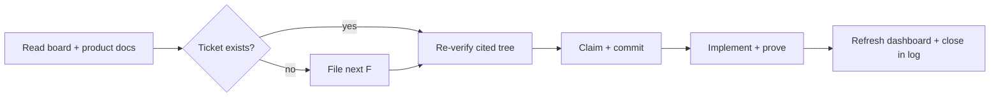

# AGENTS.md — operating guide

**This file is normative.** Every rule for a coding agent working in this repository — Codex, Claude
Code, or any other — lives here. Read it before doing anything. When this file conflicts with a
narrative document, this file wins.

## Project snapshot

WhisperMeet is a native macOS app (SwiftPM, no Xcode project) that records a meeting's microphone
and Mac system audio, then produces an accurate **post-meeting** transcript using a selected local
subprocess. OpenAI Whisper Large is the default; Apple-silicon Macs may opt into Qwen3-ASR 1.7B MLX
8-bit plus its forced aligner. Recording and transcription use no API key, no cloud upload, and no
realtime transcription; transcripts remain in their original spoken language (English or Mandarin).

The one exception is **opt-in Claude summaries**: only after a user saves a Claude API key and
confirms an explicit Summarize action is the transcript sent to Anthropic. The recording is never
mutated, failures remain retryable, and evidence always beats assertion.

## Start every task

| Step | Do this | Stop or continue when… |
|---|---|---|
| 1. Orient | Read [`docs/TICKETS.md`](docs/TICKETS.md), [`docs/NEEDS_HUMAN.md`](docs/NEEDS_HUMAN.md), and the relevant product docs from [`docs/README.md`](docs/README.md). | Never rely on an old chat description over the current tree. |
| 2. Find or file | Locate the ticket. If none covers the work, take the next free `F<n>` and file it. | Do not start an untracked task. |
| 3. Verify and claim | Re-check cited code, then set it `in-progress` with an owner and commit that claim. | Never take another agent's `in-progress` ticket. |
| 4. Build evidence | Make the smallest coherent change; keep a failing-before/passing-after test when behavior changes. | Use synthetic clips, never a user's data. |
| 5. Hand off cleanly | Run the required verification, refresh/check the dashboard, then close in the append-only log. | Mention the ticket ID in every related commit. |



## Sources at a glance

| Source | Use it for |
|---|---|
| [`docs/README.md`](docs/README.md) | The human and agent documentation map. |
| [`docs/tickets-dashboard.html`](docs/tickets-dashboard.html) | Fast, static visual view of active work; Markdown below remains authoritative. **Local-only (gitignored)**, generated by `Scripts/generate-tickets-dashboard.py`. |
| [`docs/TICKETS.md`](docs/TICKETS.md) | Active work only. **Local-only (gitignored).** |
| [`docs/NEEDS_HUMAN.md`](docs/NEEDS_HUMAN.md) | Actions or decisions only a person can make (maximum five). Version-controlled. |
| [`docs/TICKET_LOG.md`](docs/TICKET_LOG.md) | Append-only closures and real evidence. **Local-only (gitignored).** |
| [`docs/PRODUCT_SPEC.md`](docs/PRODUCT_SPEC.md) | Non-negotiable product requirements. |
| [`docs/ROADMAP.md`](docs/ROADMAP.md) | Aspirational backlog, not a commitment. |
| [`docs/CHANGELOG.md`](docs/CHANGELOG.md) | Human-facing shipped history. |

## Ticket rules

`docs/TICKETS.md` is the single source of truth for outstanding **work**; this file is the single
source of truth for the **rules** that govern it. Both are binding.

**Version control (2026-08-07).** The ticket board (`docs/TICKETS.md`), the log (`docs/TICKET_LOG.md`),
the generated dashboard (`docs/tickets-dashboard.html`), and their generator/tests
(`Scripts/generate-tickets-dashboard.py`, `Scripts/tests/test_generate_tickets_dashboard.py`) are
**gitignored, local-only agent state** — they are not committed. `docs/NEEDS_HUMAN.md` and the product
docs remain version-controlled. Because the board and log are not tracked, the "in the same commit"
requirements in the rules below are **no longer git-enforced**: read them as the discipline to keep
your local board and log in step with the code commit the work produces. That code commit still must
reference the ticket's `F<n>` (rule 7), so `git log --grep=F<n>` remains the durable trail — the ticket
entries themselves live only in your working copy.

1. **Read the board first.** Read `docs/TICKETS.md` before starting any task. If the work you are
   about to do is not on the board, file it as a ticket before you start, so parallel agents can see
   it.
2. **File what you find.** Every defect, regression, unverified claim, or follow-up you notice —
   from code review as much as from implementation — gets a ticket, even one you are not going to
   fix. A finding that lives only in a chat reply dies with the session.
3. **Verify before you claim.** Before claiming a ticket, re-verify that the cited `file:line` still
   shows the described problem in the current tree. If the code has moved or the issue is already
   gone, close the ticket `invalid` with that evidence and move on — do not fix from the ticket's
   description alone. Descriptions go stale; the tree is the source of truth.
4. **Claim before you work.** Set `Status: in-progress` and put your agent/session identifier in
   `Owner` in the **same commit that begins the work**. Never take a ticket already `in-progress`.
5. **Never delete a ticket.** Close it by moving the entry out of `docs/TICKETS.md` and appending it
   to `docs/TICKET_LOG.md` with an outcome — `fixed`, `partial`, `wontfix`, `invalid`, or
   `duplicate`. Deleting loses the reasoning.
6. **Log on close with real evidence.** Append to `docs/TICKET_LOG.md` with real command output —
   the test failing before the fix, the test passing after, the build, and any real-model run — not
   a summary of intent. The repo's culture is evidence over assertion. The log is **append-only**:
   never edit or delete a closed entry. The one sanctioned exception is appending a follow-up
   ticket's `F<n>` cross-reference to an existing entry's **Gaps** line, so deferred work it named
   stays traceable to the board.
7. **One ticket, one commit trail.** Reference the ID in **every** commit message that touches it,
   in the existing repo style: `fix(dictation): keep helper stdout pure JSON (F24)`.
8. **Escalate human-blocked work.** When you set a ticket to `needs-human`, move the entry to
   `docs/NEEDS_HUMAN.md` in the **same commit**, adding a `**What I need from you:**` line that
   states the single concrete action required. That file is capped at 5 entries; when it is full,
   stop escalating and work open tickets instead.
9. **Remove empty scaffolding.** A section header on the board with no tickets under it must be
   removed when its last ticket closes — do not leave orphaned batch headings behind.

`docs/TICKETS.md` tracks committed, verifiable work; `docs/ROADMAP.md` is the aspirational feature
backlog; `docs/CHANGELOG.md` is the human-facing narrative of shipped cycles. A roadmap item becomes
a ticket when someone commits to doing it; a ticket is a concrete, verifiable unit of work with an
owner-independent definition of done.

## ID allocation and status vocabulary

IDs are `F<n>`, continuing the finding-ID series already used in commits and `docs/CHANGELOG.md`.
**F1–F23 are consumed** by earlier review rounds (they predate the board and were never persisted —
their outcomes live in `CHANGELOG.md`). When you file a ticket, take the next free ID from the
**Next free ID** line at the top of `docs/TICKETS.md` and bump that line in the same commit. If
another agent raced you to an ID, take the next free one and move on.

| Status | Meaning |
|---|---|
| `open` | Filed, unclaimed, ready for anyone. |
| `in-progress` | Claimed. `Owner` is set. Do not touch. |
| `blocked` | Cannot proceed. `Blocked by:` states exactly what is needed and from whom. |
| `needs-human` | Requires a physical action or a decision only the user can make. Lives in `docs/NEEDS_HUMAN.md`. |

Closed states (`fixed`, `partial`, `wontfix`, `invalid`, `duplicate`) exist only in
`docs/TICKET_LOG.md`. **`partial`** means the tested core landed but the user cannot reach it yet. A
`partial` close is **invalid** unless a follow-up ticket for the remaining (reachability/wiring)
work is filed in the **same commit** and that follow-up's `F<n>` appears in the log entry.

## Definition of done

A ticket may only be closed `fixed` when all of these hold:

- `swift build` and `swift test` both pass, and the test count did not silently drop.
- Behaviour changes are covered by a test that **fails before the fix and passes after**. State both
  results in the log. A fix with no failing-test-first evidence is not done.
- **Reachability.** A ticket that adds user-facing behaviour closes `fixed` only when the new code
  is **reachable from the running app** — there is a call path from a user-triggerable surface (a
  SwiftUI view, menu command, hotkey, or app-lifecycle hook) to the new type, and that call path is
  **named in the log entry**. A tested pure core with no caller is not user-facing behaviour: it
  closes `partial`, not `fixed` (see the status vocabulary), and the follow-up wiring ticket is
  filed in the same commit. A cheap WhisperCore test does not by itself satisfy this — the incentive
  to ship an unreachable core is exactly what this rule closes.
- If the change touches the Whisper or Qwen subprocess contract, the live official docs were fetched
  and checked per the **Upstream documentation** rules below — flags and model names are never
  guessed.
- If the change touches a runtime helper or model adapter, it was exercised against the **real
  installed model**, not only a stub. Stubs cannot catch upstream API drift.
- The non-negotiable invariants in `docs/PRODUCT_SPEC.md` are intact: local-only except opt-in
  Claude summaries, the recording is the source of truth, no diarization, original language only.
- No user meeting, recording, index, or transcript was read or modified for testing. Use
  `Scripts/bench/clips`.
- **Traceable by ticket ID.** Traceability runs through the **ticket ID in the commit message**, not
  through a logged SHA. Every commit that touches a ticket names its `F<n>` (rule 7 above), so
  `git log --grep=F111` recovers the complete commit trail for any ticket at any time. The log
  entry's **Commits** field is therefore **optional** — record a SHA there only when it usefully
  pinpoints something. A commit can never contain its own SHA, so requiring one would force a second
  bookkeeping push per close for no traceability gain; do not.
- **Actionable gaps.** Every sentence in the log entry's **Gaps** section that describes work a
  person could still do carries a ticket ID. The words "follow-up", "future", "not implemented",
  "app wiring", or "is a follow-up" with no `F<n>` beside them are a rule violation. A Gap that is a
  genuine permanent limitation needs no ticket, but must say so explicitly with **"Not planned:"**.

## Ticket template (`docs/TICKETS.md`)

```markdown
### F<n> — <one-line summary>

- **Status:** open
- **Owner:** —
- **Severity:** high | medium | low
- **Area:** dictation | meetings | recording | transcription | recovery | ui | privacy | build | docs
- **Filed:** YYYY-MM-DD by <agent/session>

**Problem.** What is wrong, and the evidence it is wrong. Cite `file.swift:line`.

**Impact.** Who or what breaks, and how it presents to the user.

**Proposed fix.** Optional. Say so if you are unsure.

**Verification.** How the fixer will prove it is done.
```

### Status-specific fields

| Status | Where it lives | Required addition |
|---|---|---|
| `open` | `docs/TICKETS.md` | `Owner: —`; ready for an agent to claim. |
| `in-progress` | `docs/TICKETS.md` | A non-empty `Owner`, set when the work began. |
| `blocked` | `docs/TICKETS.md` | `**Blocked by:**` names the exact dependency and person/system. |
| `needs-human` | `docs/NEEDS_HUMAN.md` | `**What I need from you:**` gives one concrete action; keep the queue at five or fewer. |

## Ticket dashboard integrity

`docs/tickets-dashboard.html` is a local-only (gitignored), generated projection of the Markdown
sources, not a second tracker. After changing `TICKETS.md`, `NEEDS_HUMAN.md`, or `TICKET_LOG.md`, run:

```bash
python3 Scripts/generate-tickets-dashboard.py
python3 Scripts/generate-tickets-dashboard.py --check
```

`--check` validates ticket metadata, state/file placement, IDs, and the current snapshot. Agents can
use `--brief` for a compact validated handoff; it never writes files.

## Log entry template (`docs/TICKET_LOG.md`)

````markdown
## F<n> — <summary>

- **Outcome:** fixed | partial | wontfix | invalid | duplicate
- **Closed:** YYYY-MM-DD by <agent/session>
- **Commits:** _optional_ — SHA(s) worth pinpointing; the full trail is always recoverable via `git log --grep=F<n>`
- **Reachability:** <call path from a user-triggerable surface to the new code — required for a user-facing `fixed`>
- **Follow-up:** `F<n>` <required when Outcome is `partial`: the ticket for the remaining wiring>

**Root cause.** Why it happened, not just what changed.

**Fix.** What changed, and why that is the right layer to change.

**Evidence.**

```text
<real command output — failing test before, passing after, build, real-model run>
```

**Gaps.** Anything not verified, and why. Every gap that is doable work carries an `F<n>`; a genuine
permanent limitation says "Not planned:". Write "none" only if that is true.
````

## Wiring an unreachable core

Many WhisperCore features shipped a tested pure core with no caller (F79–F92). To make one reachable
without regressing testability, build it in three layers — the middle layer is the point.

1. **WhisperCore core** — already exists and is tested. Do not change it.
2. **AppModel wiring layer** — the reachable logic, headlessly testable through an injected seam in
   the F47 style: a mutable `@Sendable` closure property defaulting to the real core call, assigned
   by a test after construction (see `AppModel.recoverInterruptedRecording`). The layer builds the
   core's inputs from the store/disk and collects its outputs. **The red-green test lands here**,
   over a real fixture library in a temp `MeetingStore(rootDirectory:)` (the `WhisperMeetTests`
   precedent), asserting the core's results come back *through the app-level call* — never a direct
   core call.
3. **SwiftUI binding** — the thinnest possible: a control that calls one AppModel method, and/or a
   fold into an existing lifecycle hook. Nothing but presentation lives here. Verified manually (the
   `WhisperMeet` target has no view-render harness); state the manual steps in the log and mark the
   absence of a GUI test **"Not planned:"** — a harness limitation, not deferred work.

Name the exact call path from a user-triggerable surface to the core in the log's **Reachability**
field (see the Definition of done). If only the core lands and layers 2–3 are deferred, the ticket
closes `partial`, not `fixed`.

**Worked example — F83** (in `docs/TICKET_LOG.md`): wired F66's `MeetingIntegrityChecker` in. Layer
2 is `AppModel.verifyLibraryIntegrity()` with an injectable `checkMeetingIntegrity` seam, folded
into `performStartupRecovery`; layer 3 is a Settings "Verify Library" button. Three red-green tests
land on layer 2 (`Tests/WhisperMeetTests/LibraryIntegrityTests.swift`); the button and launch alert
are manual. Sibling tickets F79–F92 should cite this section rather than re-deriving the shape.

## Upstream documentation

Always fetch https://whisperai.com/docs before writing WhisperAI code. Verify endpoint paths and
parameters against the live docs — do not guess.

Before writing local OpenAI Whisper code, fetch the current official repository documentation at
https://github.com/openai/whisper and verify model names and command-line options against the live
source.

Before changing the **Qwen3-ASR** subprocess contract (`Scripts/qwen_transcribe.py` and
`Scripts/qwen_dictate_server.py` — the `generate(language=, chunk_duration=, min_chunk_duration=)`
call and the segment / forced-alignment shapes it reads), verify against the **pinned `mlx-audio`
package**. `Scripts/setup-qwen-asr.sh` pins `mlx-audio==0.3.1` from PyPI; there is no stable hosted
API reference for it, so — exactly as the F24 entry cited `mlx_whisper/transcribe.py:175` — **cite
the installed package source** for the pinned version (e.g. the relevant file under
`…/Runtime/Qwen3ASR/venv/lib/python*/site-packages/mlx_audio/stt/…`) rather than guessing a flag or
key. If you bump the pin, re-verify the call and output shapes against the new version's source and
record the citation in `docs/TICKET_LOG.md`.

## Repository map

| Path | What it is |
|---|---|
| `AGENTS.md` | **This file.** The normative rules for every agent. |
| `Sources/WhisperCore/` | Pure, `Sendable`, framework-free logic. |
| `Sources/WhisperMeet/` | Everything touching Apple frameworks: capture, SwiftUI, app state. |
| `Tests/WhisperCoreTests/` | Swift Testing suite (`@Test`/`#expect`) for `WhisperCore`. |
| `Tests/WhisperMeetTests/` | Headless lifecycle tests for injected seams in the app target. |
| `Scripts/` | Build/install/setup scripts and the Python subprocess helpers. |
| `Scripts/bench/clips/` | Synthetic en/zh/code-switch clips — use these, never user recordings. |
| `docs/README.md` | Human and agent documentation map. |
| `docs/tickets-dashboard.html` | Generated visual projection of the active ticket queue. |
| `docs/TICKETS.md` | Open work. Read before starting anything. |
| `docs/TICKET_LOG.md` | Closed tickets, with real command output as evidence. |
| `docs/NEEDS_HUMAN.md` | Tickets blocked on a human action or decision. Capped at 5. |
| `docs/PRODUCT_SPEC.md` | The non-negotiable product requirements. |
| `docs/ROADMAP.md` | Aspirational feature backlog (not commitments). |
| `docs/CHANGELOG.md` | Narrative record of shipped cycles. |

## Build commands

```bash
swift build                      # build the WhisperCore library + WhisperMeet executable
swift test                       # run both Swift Testing suites (does NOT download a model)
swift test --filter "original language"   # run a single test by name substring (Swift Testing)
python3 Scripts/generate-tickets-dashboard.py --check  # validate the ticket snapshot
Scripts/build-app.sh             # build + ad-hoc-sign .build/WhisperMeet.app (release)
open .build/WhisperMeet.app      # run the GUI app
Scripts/setup-local-whisper.sh   # install the local Whisper runtime from this checkout
Scripts/setup-qwen-asr.sh        # install pinned Qwen ASR + aligner (Apple silicon, opt-in)
```

Tests use the **Swift Testing** framework (`@Test`/`#expect`), not XCTest — `--filter` matches the
string in the `@Test("...")` display name. `WhisperMeetTests` may exercise app-target lifecycle
logic only through injected seams that avoid permissions, live hardware, and GUI startup.

## Architecture

Two SwiftPM targets, and the split is the key design decision:

- **`WhisperCore`** (library, tested) — pure, `Sendable`, framework-free logic. Contains the local
  subprocess contracts (`LocalWhisperClient`/`LocalWhisperRuntime` and
  `QwenASRClient`/`QwenASRRuntime`), the transcript data model (`TranscriptModels.swift`), the
  crash-safe index store (`BackupJSONStore`), interrupted-recording rebuild
  (`InterruptedRecordingRecovery`), and the Claude summarizer (`MeetingSummarizer` protocol +
  `ClaudeSummarizer`, a raw-HTTPS `URLSession` client — no Swift SDK exists). No AppKit/SwiftUI
  import — this is why it's unit-testable without a GUI (the summarizer is tested with a
  `URLProtocol` stub). Its import policy is the **WhisperCore purity rule** below.
- **`WhisperMeet`** (executable, macOS 15+) — everything that touches Apple frameworks:
  `AudioCaptureEngine` (ScreenCaptureKit), `MeetingStore`, `AppModel`, SwiftUI `ContentView`,
  `VocabularyExtractor`. Keep macOS-framework code out of `WhisperCore`.

**Pipeline (record → transcribe):** `AppEntry` → `AppModel` (`@MainActor` orchestrator, owns
recording/transcription state machines) → `AudioCaptureEngine.start/stop` captures **two separate
Float32 tracks** (system + mic) via one `SCStream`, then `FloatTrackMixer` time-aligns them (padding
by first-presentation-time offset) into a 16-bit mono `meeting.wav` and writes `source-tracks.json`
→ `MeetingStore.upsert` persists the `MeetingRecord` → `AppModel.beginTranscription` snapshots the
selected engine/language and queues the job. Whisper runs its CLI contract; Qwen runs the bundled
`qwen_transcribe.py` against pinned local models and maps forced alignment back to timestamped
sentences. Either complete result is then written into `MeetingStore`; if Qwen alignment fails, its
complete text remains authoritative.

**Concurrency model:** `AppModel` and `MeetingStore` are `@MainActor`. All of `WhisperCore` is
`Sendable`. Blocking work (subprocess runs, the installer, WAV rebuild) is pushed to
`Task.detached`. Only one transcription runs at a time (guarded by `activeTranscriptionID`).

### The Whisper CLI contract (`LocalWhisperClient.commandArguments`)

This is the integration boundary with an external tool. Before changing model names or CLI flags,
follow the **Upstream documentation** rules above: fetch the current official docs at
https://github.com/openai/whisper and verify against the live source — do not guess flags or model
names. Current contract: models `large` (accuracy default) and `turbo`; `--task transcribe`;
`--output_format json`; `--model_dir` points at the app's local model cache; omit `--language` for
auto-detect.

### Storage layout

Everything lives under `~/Library/Application Support/WhisperMeet/`: `Runtime/venv/bin/whisper`
(installed runtime), `Models/` (downloaded once on first use), `Runtime/Qwen3ASR/` (optional Qwen
environment, ASR model, aligner, helper, and manifest), `Recordings/<meeting-uuid>/` (`meeting.wav`,
`system-audio.f32`, `microphone-audio.f32`, `source-tracks.json`), and `meetings.json` /
`vocabulary.json` (+ their `.backup.json`). `LocalWhisperRuntime.findExecutable()` also falls back
to Homebrew/`~/.local/bin` installs.

### Non-negotiable invariants

The product's non-negotiable invariants — what must never regress — live in `docs/PRODUCT_SPEC.md`.
This file does not restate them; a second copy is a second thing to drift. The **Definition of
done** above requires every change to leave them intact.

### Build config note

`swift-tools-version: 6.0` but `swiftLanguageModes: [.v5]` — the code compiles under the **Swift 5
language mode** (with explicit `Sendable`/`@MainActor` annotations), not full Swift 6 strict
concurrency. `WhisperMeet` links its Apple frameworks explicitly in `Package.swift`.

## WhisperCore purity rule

`Sources/WhisperCore/` is pure, `Sendable`, framework-free logic: every file imports only
`Foundation`, with a **single sanctioned exception** — `WarmWhisperDictationEngine.swift` imports
`Darwin` solely for `SIGKILL` to force-stop a wedged helper process, for which there is no
Foundation equivalent. Do not add AppKit/SwiftUI/`os`/other framework imports; surface diagnostics
through return values instead, as `TranscriptionResult.alignmentWarning` does.

Verified current state (`grep -rn '^import' Sources/WhisperCore`): every source imports `Foundation`
only, plus the one `import Darwin` in `WarmWhisperDictationEngine.swift`. The earlier `import os` in
`QwenASRClient.swift` was the F28 deviation; it was removed when F28 shipped (commit `2cea357`), so
there is **no open purity defect today**. If you reintroduce a framework import, that is a new
defect — file a ticket per the rules above.

See `README.md` for the end-user workflow and `docs/RECOVERY.md` for exact recovery file locations.
